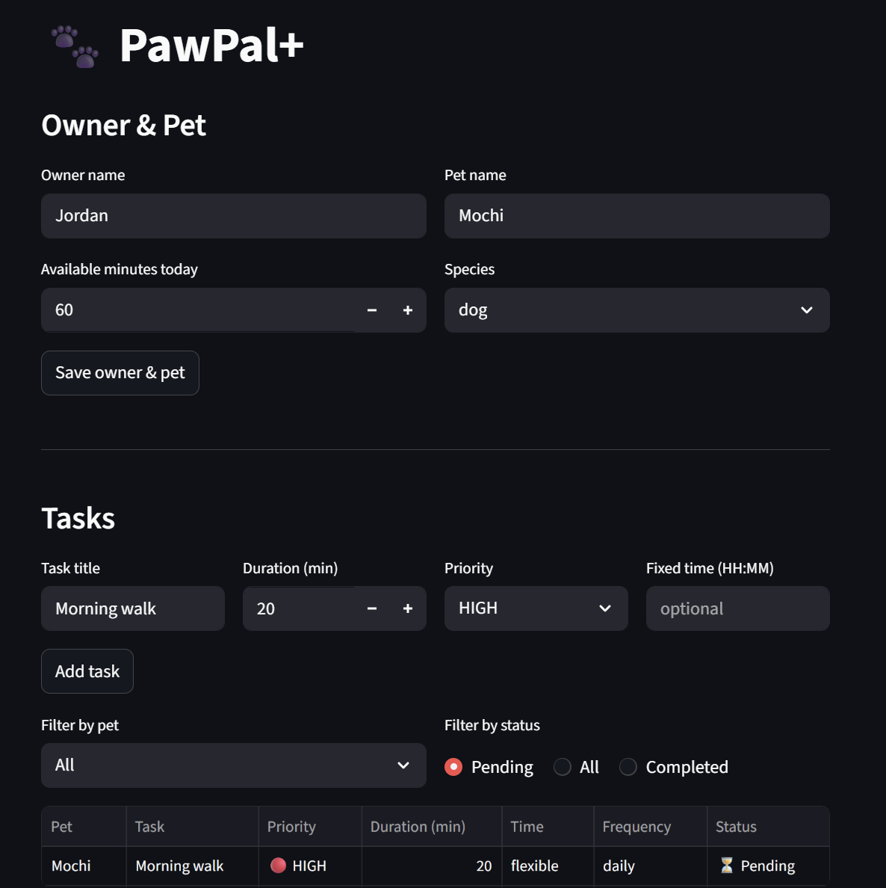
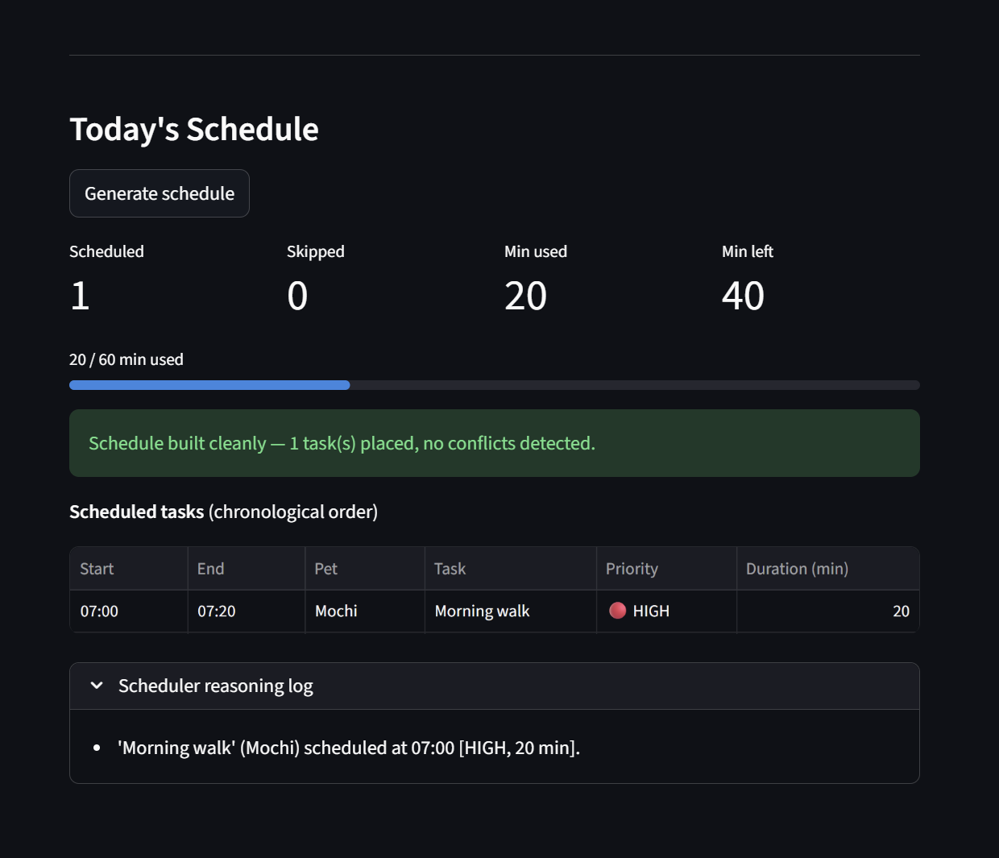
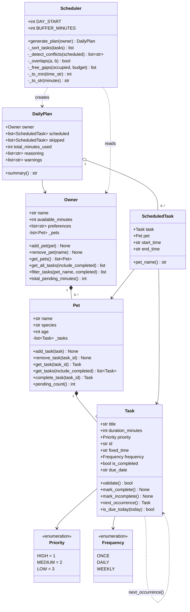

# PawPal+

A smart daily pet-care scheduler built with Python and Streamlit. PawPal+ helps busy pet owners stay consistent by turning a list of care tasks into a prioritized, conflict-free daily plan — with plain-language explanations of every scheduling decision.

---

## Table of contents

- [Demo](#-demo)
- [Features](#features)
- [Project structure](#project-structure)
- [Installation](#installation)
- [Running the app](#running-the-app)
- [How to use](#how-to-use)
- [Scheduling logic](#scheduling-logic)
- [System architecture](#system-architecture)
- [Testing PawPal+](#testing-pawpal)
- [Known limitations](#known-limitations)

---

## 📸 Demo

<a href="pawpal1.png" target="_blank"></a>

<a href="pawpal2.png" target="_blank"></a>

---

## Features

### Sorting by time and priority

Fixed-time tasks are sorted chronologically and placed into the schedule first. Flexible tasks are then ordered using a two-key comparator inside `Scheduler._sort_tasks()`: **priority value** (HIGH=1, MEDIUM=2, LOW=3) first, then **shortest duration** as a tiebreaker within the same priority level. This ensures critical tasks are never blocked by a long low-priority task that happened to be added first. The final `DailyPlan.scheduled` list is always returned in wall-clock order regardless of the order tasks were added.

### Gap filling with 5-minute buffer

After fixed-time tasks are anchored, `Scheduler._free_gaps()` computes the remaining open intervals starting at 07:00. Each flexible task requires `duration + 5 minutes` of free space before it can be placed — the 5-minute buffer (`BUFFER_MINUTES`) prevents back-to-back tasks with no transition time. Tasks are placed greedily: the first gap that fits is used. If no gap is large enough, the task is moved to `DailyPlan.skipped` with an explanation.

### Conflict warnings

Overlapping fixed-time tasks are caught in two passes. During placement, each incoming fixed task is checked against already-accepted ones using `Scheduler._overlaps()` — if a conflict is found, the later task is immediately moved to `skipped` and a warning is recorded. After all tasks are placed, `Scheduler._detect_conflicts()` runs a second verification pass using `itertools.combinations` on the full scheduled list, catching anything that slipped through. All warnings are surfaced in `DailyPlan.warnings` and displayed prominently in the UI before the schedule table.

### Daily and weekly recurrence

Every `Task` carries a `frequency` field (ONCE, DAILY, or WEEKLY) and a `due_date` string. When `Pet.complete_task()` is called, it marks the original task done and calls `Task.next_occurrence()`, which calculates the next `due_date` using `timedelta` (today + 1 day for DAILY, today + 7 days for WEEKLY) and returns a fresh `Task` instance. That successor is automatically appended to the pet's task list. ONCE tasks return `None` from `next_occurrence()` and produce no successor. Tasks whose `due_date` is in the future are filtered out of today's plan by `Task.is_due_today()`.

### Filtered task view

`Owner.filter_tasks(pet_name, completed)` applies up to two independent narrowing filters — by pet name, by completion status, or both — over the full cross-pet task list. The UI passes the result through the same `Scheduler._sort_tasks()` call used during scheduling, so the browse table always reflects true scheduler priority order rather than insertion order.

### Budget tracking and metrics

The UI displays four `st.metric` tiles (tasks scheduled, tasks skipped, minutes used, minutes remaining) and a `st.progress` bar calibrated to `total_minutes_used / available_minutes`. This gives an at-a-glance view of how fully packed the day is without reading the schedule table.

### Reasoning log

Every placement and skip decision appends a plain-English sentence to `DailyPlan.reasoning`. The log is exposed in a collapsible `st.expander` so it is available when you want to understand a decision but stays out of the way during normal use.

### Urgency-weighted prioritization *(Agent Mode feature)*

Static priority alone has a blind spot: a HIGH task added today outranks a MEDIUM task that has been pending for four days, even when the MEDIUM task is genuinely more urgent. PawPal+ solves this with a dynamic urgency score computed at scheduling time.

**Formula:** `urgency_score = max(priority.value − days_overdue × 0.4, 0.1)`

| Task | Priority value | Days overdue | Urgency score | Scheduled position |
|---|---|---|---|---|
| Fresh HIGH | 1.0 | 0 | **1.0** | 1st |
| MEDIUM, 2 days overdue | 2.0 | 2 | **1.2** | 2nd |
| MEDIUM, 4 days overdue | 2.0 | 4 | **0.4** | ahead of fresh HIGH |
| LOW, 6 days overdue | 3.0 | 6 | **0.6** | between HIGH and MEDIUM |

Lower score = placed earlier. The floor of `0.1` ensures no task ever scores negative. Crossover points: a MEDIUM task overtakes a fresh HIGH after **3 days** overdue; a LOW task overtakes a fresh HIGH after **5 days** overdue.

The score is calculated in `Task.urgency_score(today)` and used as the primary sort key in `Scheduler._sort_tasks()`, replacing the static `priority.value` that was there before. Duration remains the tiebreaker for tasks with equal scores.

#### How Agent Mode was used to implement this

This feature was implemented using Claude Code in Agent Mode. Rather than writing the algorithm manually, the following prompt was given to the agent:

> *"Add a third algorithmic capability to pawpal_system.py. Implement urgency-weighted scoring on Task — a method that combines priority with days overdue into a single float. Update Scheduler._sort_tasks to use it as the primary sort key. Add 5 tests covering: fresh task score equals priority value, score decreases as overdue days grow, an overdue MEDIUM outranks a fresh HIGH, the floor never goes negative, and fresh tasks still sort in priority order. Document the formula and crossover points. Run the full test suite and confirm all tests pass."*

Agent Mode worked autonomously across three files — `pawpal_system.py`, `tests/test_pawpal.py`, and this README — in a single pass: it added `urgency_score()` to `Task`, updated `_sort_tasks()` with a `today` parameter defaulting to `date.today()` so existing call sites required no changes, wrote five targeted tests, and verified all 22 tests passed before stopping. The key judgment call the agent made correctly was keeping `today` optional so the existing test suite and the `app.py` call to `_sort_tasks` both continued to work without modification.

---

## Project structure

```
pawpal_system.py   Core data model and scheduling logic (no UI dependencies)
app.py             Streamlit UI — connects pawpal_system to the browser
tests/
  test_pawpal.py   17 pytest tests covering sorting, recurrence, and conflict detection
requirements.txt   Python dependencies (streamlit, pytest)
reflection.md      Design narrative and project retrospective
```

---

## Installation

**Requirements:** Python 3.10 or later

```bash
# 1. Clone or download the project
git clone <your-repo-url>
cd ai110-module2show-pawpal-starter

# 2. Create and activate a virtual environment
python -m venv .venv
source .venv/bin/activate        # macOS / Linux
.venv\Scripts\activate           # Windows

# 3. Install dependencies
pip install -r requirements.txt
```

---

## Running the app

```bash
streamlit run app.py
```

Streamlit will open the app automatically at `http://localhost:8501`.

---

## How to use

### 1. Set up your owner and pet

Fill in your name, how many minutes you have available today, and your pet's name and species. Click **Save owner & pet** to apply. The time budget is the total window the scheduler can fill — it does not need to be contiguous.

### 2. Add tasks

| Field | Required | Notes |
|---|---|---|
| Task title | Yes | Any non-empty string |
| Duration (min) | Yes | 1–240 minutes |
| Priority | Yes | HIGH, MEDIUM, or LOW |
| Fixed time (HH:MM) | No | Leave blank for a flexible task |

Tasks with a fixed time are anchored to that slot. Tasks without one are placed in the best available gap. Click **Add task** — invalid entries (empty title, bad time format, zero duration) show an inline error without saving.

### 3. Browse and filter tasks

Use the **Filter by pet** and **Filter by status** controls to slice the task list. The table is sorted automatically: fixed-time tasks appear first in chronological order; flexible tasks follow, sorted by priority then duration. Status is shown as "Done" or "Pending".

### 4. Generate today's schedule

Click **Generate schedule**. The app will:

1. Show any **conflict warnings** at the top if two fixed-time tasks overlap
2. Display four **metrics** — tasks scheduled, tasks skipped, minutes used, minutes remaining
3. Render a **progress bar** for your time budget
4. Show the **scheduled tasks** table in wall-clock order
5. Show the **skipped tasks** table with the reason (conflict or no time remaining)
6. Provide a collapsible **reasoning log** with a plain-English explanation of every decision

---

## Scheduling logic

### Priority and sort order

Flexible tasks are sorted before placement using a two-key comparator:

1. **Priority value** — HIGH (1) before MEDIUM (2) before LOW (3)
2. **Duration** — shorter tasks first within the same priority level, so small tasks don't crowd out longer ones

Fixed-time tasks are sorted chronologically and placed first, independent of priority.

### Gap filling with buffer

After fixed-time tasks are placed, the scheduler computes the remaining free intervals starting at 07:00. Each flexible task needs `duration + 5 minutes` of buffer to be placed in a gap. This prevents tasks from running directly into each other with no breathing room.

### Conflict detection

Two passes catch conflicts:

- **During placement** — when processing fixed-time tasks, each new task is checked against already-accepted ones. A conflict skips the later task immediately and records a warning.
- **After placement** — `_detect_conflicts()` scans all placed tasks as a verification pass, catching anything the placement logic may have missed.

### Recurring tasks

| Frequency | Behavior on completion |
|---|---|
| ONCE | Marked done; no successor created |
| DAILY | Marked done; a new task is appended with `due_date = today + 1 day` |
| WEEKLY | Marked done; a new task is appended with `due_date = today + 7 days` |

Tasks with a `due_date` in the future are excluded from today's plan automatically.

---

## System architecture

Eight classes in `pawpal_system.py` with a clean separation of concerns:

```
Priority   Frequency              (enums — shared constants, no logic)
Task                              (data + recurrence methods)
Pet                               (owns and manages a list of Tasks)
Owner                             (owns Pets; provides cross-pet queries)
ScheduledTask                     (output type: Task + Pet + time slot)
DailyPlan                         (output type: full plan with warnings)
Scheduler                         (all scheduling logic; reads Owner, produces DailyPlan)
```

`Owner`, `Pet`, and `Task` are pure data classes with no scheduling logic. `Scheduler` is stateless — calling `generate_plan` with the same `Owner` twice produces the same result. `DailyPlan` is the immutable output; `app.py` only reads from it.

### Class diagram



---

## Testing PawPal+

### Run the test suite

```bash
python -m pytest tests/test_pawpal.py -v
```

All 17 tests should pass in under one second.

### What the tests cover

**Sorting correctness (4 tests)**
Verifies that the final schedule is always in chronological order, that `_sort_tasks` places HIGH-priority tasks before LOW, and that equal-priority tasks are ordered shortest-first. One end-to-end test confirms priority ordering survives the full `generate_plan` call.

**Recurrence logic (5 tests)**
Confirms that completing a DAILY task appends a successor due tomorrow and a WEEKLY task appends one due in 7 days. Verifies that a ONCE task produces no successor, that a completed ONCE task is excluded from the next generated plan, and that a task with a future `due_date` does not appear in today's schedule.

**Conflict detection (6 tests)**
Ensures overlapping fixed-time tasks produce a warning and that the conflicting task lands in `skipped`. Verifies the inverse: non-overlapping tasks and back-to-back tasks (end time == start time) generate zero warnings. Two tests call `_detect_conflicts` directly as unit tests independent of the full scheduler.

### Confidence level

**4 / 5 stars**

The core behaviors — priority sorting, recurring task lifecycle, and fixed-time conflict detection — are well-covered and all 17 tests pass cleanly. The missing star reflects untested surface area: the Streamlit UI layer, multi-pet and multi-owner interactions, and budget-exhaustion edge cases where a task is exactly one minute too large to fit.

---

## Known limitations

- **Single pet per session** — the UI initializes with one pet. Multi-pet support exists in the data model (`Owner` holds a list of `Pet` objects) but the form only manages one at a time.
- **No persistence** — all data lives in Streamlit session state and resets on page refresh. There is no database or file save.
- **Greedy scheduling** — the scheduler uses a first-fit strategy. It places each flexible task in the earliest gap that fits rather than searching for the globally optimal arrangement. For a daily pet-care app this is acceptable; for tightly packed schedules it may leave reachable combinations on the table.
- **07:00 day start** — the schedule window always begins at 07:00 (`Scheduler.DAY_START`). Tasks cannot be placed before that time even if the budget would allow it.
